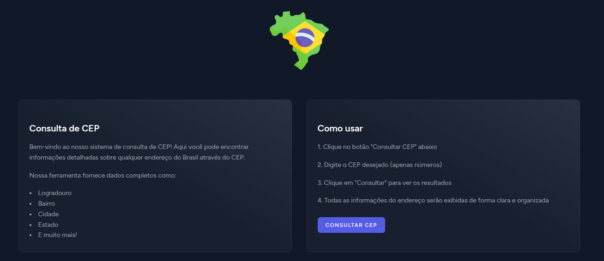
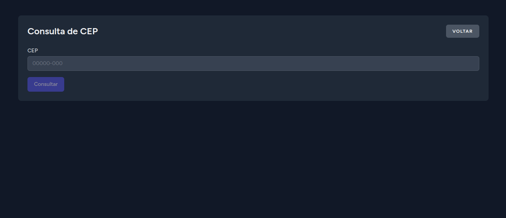
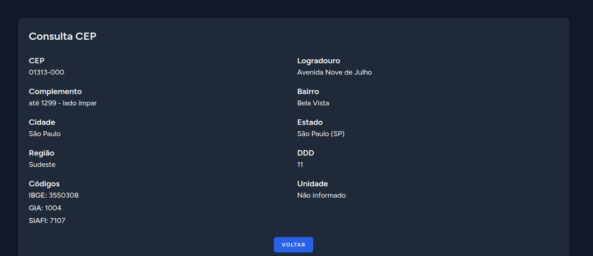

# Consulta de CEP - Laravel + Vue + Inertia





## Como rodar o projeto

Siga os passos abaixo para instalar e executar o projeto localmente:

### 1. Clone o repositório
```bash
git clone https://github.com/marksousa/avaltectrade.git
cd avaltectrade
```

### 2. Copie o arquivo de ambiente
```bash
cp .env.example .env
```

### 3. Instale as dependências PHP
```bash
composer install
```

### 4. Instale as dependências JavaScript
```bash
npm install
```

### 5. Gere a chave da aplicação
```bash
php artisan key:generate
```

### 6. (Opcional) Configure o banco de dados
Esse projeto nao usa BD, pode pular este passo. Caso queira usar, configure as variáveis no `.env` e rode:
```bash
php artisan migrate
```

### 7. Configure a URL do ViaCEP (opcional)
No arquivo `.env`, garanta que existe:
```
VIA_CEP_URL=https://viacep.com.br/ws/
```
Se não existir, o sistema usará esse valor como padrão.

### 8. Rode o servidor de desenvolvimento
```bash
php artisan serve
```

### 9. Rode o build do frontend (em outro terminal)
```bash
npm run dev
```

### 10. Acesse o sistema
Abra o navegador em [http://localhost:8000](http://localhost:8000)

### 11. Rodando os testes
Para rodar os testes automatizados:
```bash
./vendor/bin/pest
```

---

Se tiver dúvidas, consulte o código ou abra uma issue!
